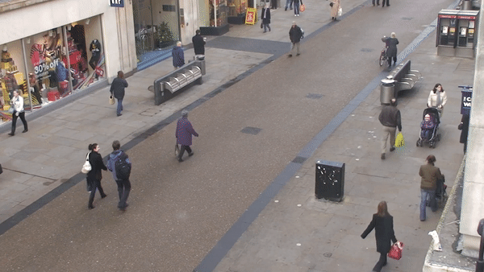
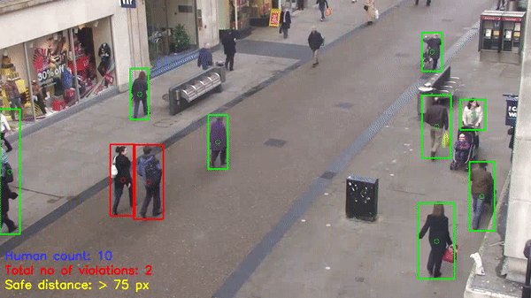

 

# Social-Distancing-in-Real-Time
Social distancing in Real-Time using live video stream/IP camera in OpenCV.

Input      |  Output
:-------------------------:|:-------------------------:
<<<<<<< HEAD
  |  
=======
  |  
>>>>>>> 399732c6d704560b10b774e41b49391dff607cc7

---
## Features
- Accept feed from live cam.
- counting the number of people in real-time.
- Sending an alert(audio) if the people are way over the 
   social distancing limits.
- Safe distance entered by the user (GUI)
- Detect humans in the frame with yolov4
- Stores violations in a csv file.

